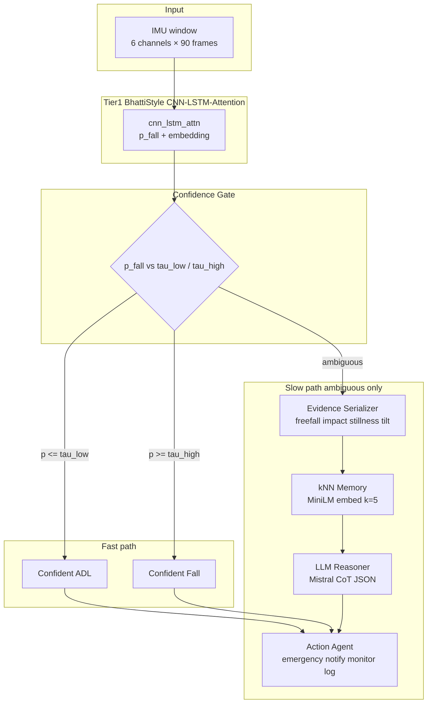
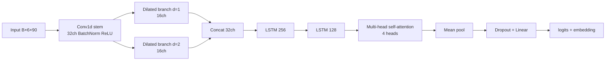
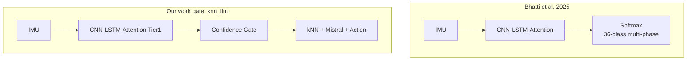
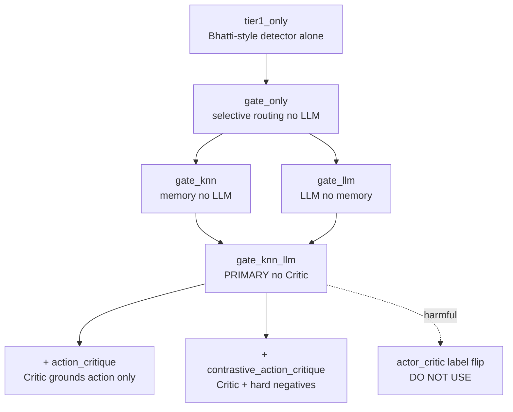
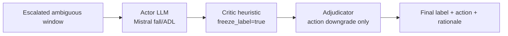
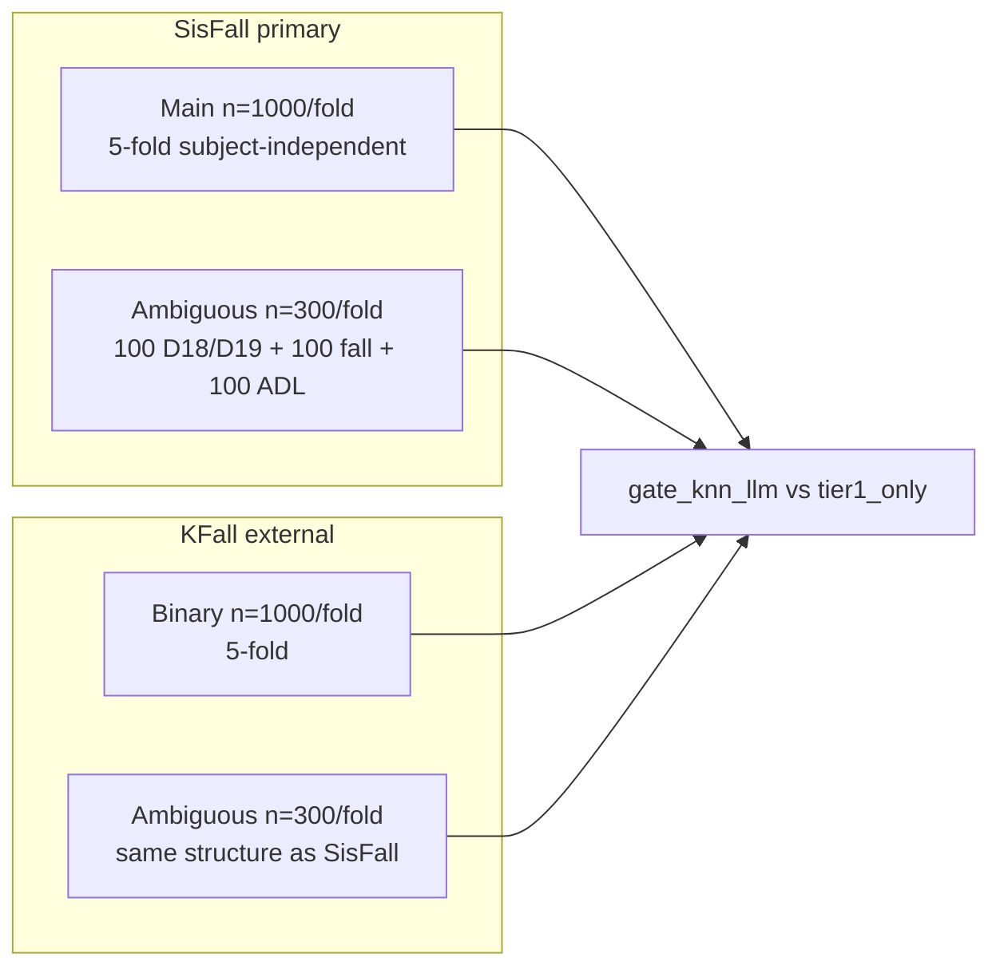

# Complete Results & Architecture Reference

**Project:** Agentic Fall Detection (confidence-gated multi-agent wrapper)  
**Primary stack (no Critic):** `gate_knn_llm` = Tier-1 → Gate → kNN → Mistral (Ollama) → Action  
**LLM:** `mistral:latest` via Ollama (`http://127.0.0.1:11434`)  
**Cost metric:** `10×FN + 1×FP` (clinical safety cost; missed falls weighted 10×)  
**Generated:** 2026-08-22  

---

## Table of contents

1. [Architecture diagrams (Mermaid)](#1-architecture-diagrams-mermaid)
2. [Positioning vs Bhatti et al. 2025](#2-positioning-vs-bhatti-et-al-2025)
3. [Evaluation protocols & datasets](#3-evaluation-protocols--datasets)
4. [SisFall — main 5-fold (n=1000/fold)](#4-sisfall--main-5-fold-n1000fold)
5. [SisFall — modified ambiguous bench (300/fold)](#5-sisfall--modified-ambiguous-bench-300fold)
6. [KFall — binary main 5-fold (n=1000/fold)](#6-kfall--binary-main-5-fold-n1000fold)
7. [KFall — modified ambiguous bench (300/fold)](#7-kfall--modified-ambiguous-bench-300fold)
8. [Ablation ladder (module contribution)](#8-ablation-ladder-module-contribution)
9. [LLM backend comparison (Mistral vs heuristic vs Qwen)](#9-llm-backend-comparison-mistral-vs-heuristic-vs-qwen)
10. [Critique vs no-Critic (all modes)](#10-critique-vs-no-critic-all-modes)
11. [Master summary across all datasets](#11-master-summary-across-all-datasets)
12. [What to claim / what not to claim](#12-what-to-claim--what-not-to-claim)
13. [Source files index](#13-source-files-index)

---

## 1. Architecture diagrams (Mermaid)

### 1.1 End-to-end pipeline (`gate_knn_llm`, no Critic)

### 1.2 Tier-1 detector block (Bhatti-style reimplementation)

**Code:** `src/agentic_fall/models/cnn_lstm_attn.py`  
**Config:** `configs/tier1_sisfall.yaml`, `configs/tier1_kfall_binary.yaml`

### 1.3 Bhatti vs our full system

### 1.4 Ablation mode ladder

### 1.5 Critique-enabled path (optional appendix only)

**Default:** `adjudication.enabled: false` in `configs/agentic.yaml`

### 1.6 Dataset evaluation map

---

## 2. Positioning vs Bhatti et al. 2025

| Aspect | Bhatti et al. (IEEE Access 2025) | Our work |
|--------|----------------------------------|----------|
| **Paper** | [Beyond Falls](https://doi.org/10.1109/access.2025.3641198) | Agentic safety layer on Bhatti-**style** Tier-1 |
| **Primary task** | Multi-phase 36-class detection on KFall | Binary Fall/ADL + uncertainty + response |
| **Backbone** | CNN–LSTM–Attention | Same family (our reimplementation + zoo) |
| **Dataset (their paper)** | KFall only | SisFall primary; KFall external |
| **Uncertainty** | Softmax confidence only | Dual-threshold confidence gate |
| **Memory / LLM** | None | kNN + local Mistral CoT |
| **Response policy** | None | Cost-sensitive Action Agent |
| **Published F1** | ~**98%** (36-class KFall) | Not comparable directly |
| **Fair baseline in our tables** | — | `tier1_only` = same checkpoint, same folds |

> **Honesty rule:** We do **not** claim beating Bhatti's published ~98% multi-class KFall table. We claim improving **recall / cost under uncertainty** vs the **same Tier-1 checkpoint** under our locked protocols.

---

## 3. Evaluation protocols & datasets

| Benchmark | Path | n/fold | Split | Contents |
|-----------|------|--------|-------|----------|
| **SisFall main** | `data/processed/sisfall/` | 1000 | 5-fold subject-independent | Stratified Fall/ADL + forced D18/D19 |
| **SisFall ambiguous** | `data/kfold_ambiguous/` | 300 | Real K-fold test windows | 100 D18/D19 + 100 fall + 100 clear ADL |
| **KFall binary main** | `data/processed/kfall/` | 1000 | 5-fold subject-independent | Binary Fall vs ADL |
| **KFall ambiguous** | `data/kfold_ambiguous_kfall/` | 300 | Real K-fold test windows | Same 300-window structure |

**Modes compared in this document:**

| Mode | Critic? | Description |
|------|---------|-------------|
| `tier1_only` | No | Bhatti-style CNN-LSTM-Attn alone |
| `gate_knn_llm` | **No** | **Primary paper stack** |
| `gate_knn_llm` + heuristic backend | No | Rule-based reasoner (ablation only) |
| `gate_knn_llm_action_critique` | Yes (Q1-safe) | Labels frozen; Critic grounds/downgrades action |
| `gate_knn_llm_contrastive_action_critique` | Yes (contrastive) | + hard-negative ADL cases to Critic |
| `gate_knn_llm_actor_critic` | Yes (label flip) | **Harmful** — do not use in main tables |
| `gate_knn_llm_crc_veto` | Yes (+ CRC) | Certified veto path; veto rate = 0 in runs |

---

## 4. SisFall — main 5-fold (n=1000/fold)

**Protocol:** Homogeneous stratified windows, forced D18/D19, cost per 1000 windows.  
**Backend:** Ollama / Mistral for `gate_knn_llm`.

### Table 4.1 — Per-fold: Tier-1 vs stack (no Critic)

| Fold | n | Tier-1 F1 | Tier-1 Rec | Tier-1 cost/1k | Stack F1 | Stack Rec | Stack cost/1k | ΔF1 | Cost ↓ |
|------|---|-----------|------------|----------------|----------|-----------|---------------|-----|--------|
| 0 | 1000 | 0.774 | 0.781 | 1042 | **0.892** | **0.986** | **156** | +0.119 | 85% |
| 1 | 1000 | 0.737 | 0.748 | 1223 | **0.851** | **0.911** | **490** | +0.114 | 60% |
| 2 | 1000 | 0.755 | 0.783 | 1066 | **0.874** | **0.998** | **134** | +0.119 | 87% |
| 3 | 1000 | 0.766 | 0.732 | 1248 | **0.930** | **0.995** | **83** | +0.164 | 93% |
| 4 | 1000 | 0.760 | 0.749 | 1175 | **0.887** | **0.993** | **136** | +0.126 | 88% |

### Table 4.2 — 5-fold mean ± std (main claim)

| Mode | F1 | Recall | Cost / 1000 |
|------|-----|--------|-------------|
| `tier1_only` (Bhatti-style) | 0.759 ± 0.014 | 0.759 ± 0.022 | 1151 ± 93 |
| **`gate_knn_llm` (no Critic)** | **0.887 ± 0.029** | **0.977 ± 0.037** | **200 ± 164** |

- Mean ΔF1 = **+0.128**
- Mean ΔRecall = **+0.218**
- Mean cost reduction ≈ **83%**

### Table 4.3 — Paired statistics (stack − Tier-1)

| Metric | Mean Δ | Bootstrap 95% CI | Wilcoxon p |
|--------|--------|------------------|------------|
| cost_per_1000 | −951 | [−1084, −825] | 0.0625 |
| f1 | +0.128 | [0.117, 0.147] | 0.0625 |
| recall | +0.218 | [0.187, 0.248] | 0.0625 |

**Source:** `results/PROFESSOR_MEETING_BRIEF.md`

---

## 5. SisFall — modified ambiguous bench (300/fold)

**Path:** `data/kfold_ambiguous/` · **Backend:** Ollama / Mistral  
**Structure:** 100 D18/D19 ambiguous + 100 fall + 100 clear ADL per fold

### Table 5.1 — Per-fold: no Critic comparison

| Fold | tier1_only F1 | tier1 Cost | gate_knn_llm F1 | stack Cost | AmbAcc (stack) | Δ Cost |
|------|---------------|------------|-----------------|------------|----------------|--------|
| 0 | 0.696 | 258 | **0.868** | **39** | 0.950 | −219 |
| 1 | 0.738 | 245 | **0.894** | **85** | 0.980 | −160 |
| 2 | 0.682 | 295 | **0.892** | **33** | 0.970 | −262 |
| 3 | 0.714 | 277 | **0.902** | **48** | 0.990 | −229 |
| 4 | 0.735 | 279 | **0.922** | **17** | 0.940 | −262 |

### Table 5.2 — 5-fold mean (ambiguous bench)

| Mode | F1 | Recall | Cost | AmbAcc | FAR |
|------|-----|--------|------|--------|-----|
| `tier1_only` | 0.713 | 0.768 | 271 | 0.812 | 0.194 |
| **`gate_knn_llm` (Mistral)** | **0.896** | **0.976** | **44** | **0.966** | 0.102 |
| `gate_knn_llm` (heuristic) | 0.766 | 0.726 | 291 | 0.990 | 0.085 |

- Cost reduction (Mistral stack vs tier1): **83.6%**
- ΔF1 (Mistral stack vs tier1): **+0.183**

**Source:** `results/kfold_ambiguous/COMPARISON_NO_CRITIC.txt`, `ALL_FOLDS_REPORT.txt`, `results/kfold_ambiguous_heuristic/`

---

## 6. KFall — binary main 5-fold (n=1000/fold)

**Path:** `data/processed/kfall/` · **Protocol:** Binary Fall/ADL, same cost model  
**Source:** `results/kfall/kfall_external_summary.json`

### Table 6.1 — Per-fold

| Fold | tier1_only F1 | tier1 Rec | tier1 cost/1k | stack F1 | stack Rec | stack cost/1k |
|------|---------------|-----------|---------------|----------|-----------|---------------|
| 0 | 0.992 | 0.998 | 17 | **0.993** | **1.000** | **7** |
| 1 | 0.987 | 0.996 | 31 | 0.986 | 0.996 | 32 |
| 2 | 0.987 | 0.994 | 40 | **0.989** | **0.996** | **29** |
| 3 | 0.992 | 0.990 | 53 | **0.995** | **0.996** | **23** |
| 4 | 0.980 | 0.979 | 109 | **0.989** | **0.994** | **38** |

### Table 6.2 — 5-fold mean

| Mode | F1 | Recall | Cost / 1000 | FAR (D18/D19) |
|------|-----|--------|-------------|---------------|
| `tier1_only` | 0.987 ± 0.005 | 0.991 ± 0.007 | 50 ± 35 | 0.068 |
| **`gate_knn_llm` (no Critic)** | **0.990 ± 0.004** | **0.996 ± 0.002** | **26 ± 12** | 0.063 |

> KFall Tier-1 is near ceiling; agentic stack mainly **lowers cost** and slightly improves recall.

---

## 7. KFall — modified ambiguous bench (300/fold)

**Path:** `data/kfold_ambiguous_kfall/` · **Status:** Complete (all 5 folds)  
**Source:** `results/kfold_ambiguous_kfall/COMPARISON_NO_CRITIC.txt`, `ALL_FOLDS_REPORT.txt`

### Table 7.1 — Per-fold: no Critic

| Fold | tier1_only F1 | tier1 Cost | gate_knn_llm F1 | stack Cost | AmbAcc (stack) |
|------|---------------|------------|-----------------|------------|----------------|
| 0 | 0.966 | 16 | **0.990** | **2** | 1.000 |
| 1 | 0.985 | 3 | **1.000** | **0** | 1.000 |
| 2 | 0.947 | 20 | **0.976** | **5** | 0.960 |
| 3 | 0.985 | 3 | 0.966 | 7 | 0.940 |
| 4 | 0.957 | 18 | **0.985** | **12** | 0.980 |

### Table 7.2 — 5-fold mean

| Mode | F1 | Recall | Cost | AmbAcc | FAR |
|------|-----|--------|------|--------|-----|
| `tier1_only` | 0.968 | 0.994 | 12 | 0.942 | 0.030 |
| **`gate_knn_llm` (Mistral)** | **0.983 ± 0.012** | **0.998 ± 0.004** | **5.2 ± 4.2** | **0.976** | 0.016 |

- Mean tier1 Cost = **12** → stack Cost = **5** (~58% reduction)

---

## 8. Ablation ladder (module contribution)

**SisFall Fold 0, n=4000** — shows why kNN + LLM together are required.

| Mode | Critic? | F1 | Recall | Cost | Near-fall FAR | Escalated F1 |
|------|---------|-----|--------|------|---------------|--------------|
| `tier1_only` | No | 0.788 | 0.787 | 4596 | 0.219 | 0.000 |
| `gate_only` | No | 0.788 | 0.787 | 4596 | 0.219 | 0.175 |
| `gate_knn` | No | 0.789 | 0.764 | 4972 | 0.188 | 0.026 |
| `gate_llm` | No | 0.760 | 0.924 | 2491 | 0.625 | 0.445 |
| **`gate_knn_llm`** | **No** | **0.907** | **0.993** | **516** | 0.212 | **0.952** |

**Readout:** Gate alone ≈ no gain. kNN alone can hurt. LLM alone hurts FAR. **Only kNN + LLM together** gives the headline result.

**Source:** `results/fold0/ablation_fold0_full4000.json`

---

## 9. LLM backend comparison (Mistral vs heuristic vs Qwen)

**Task:** Paired ambiguous-case eval (forced escalation), 5-fold mean.

| Backend | Ambiguous F1 | Recall | Cost/1k | Notes |
|---------|--------------|--------|---------|-------|
| **heuristic** (rules) | 0.034 | 0.018 | 6416 | Fails on ambiguous cases |
| **mistral:latest** | **0.972** | **1.000** | **37** | **Primary paper LLM** |
| qwen2.5-coder:7b | 0.823 | 1.000 | 280 | High FAR (~0.68) |

### Per-fold ambiguous F1 (escalated cases)

| Fold | Heuristic | Mistral | Qwen2.5 |
|------|-----------|---------|---------|
| 0 | 0.042 | 0.959 | 0.807 |
| 1 | 0.105 | 0.977 | 0.874 |
| 2 | 0.000 | 0.975 | 0.819 |
| 3 | 0.021 | 0.984 | 0.802 |
| 4 | 0.000 | 0.966 | 0.813 |

**Source:** `results/aggregate_llm_mean_std.json`, `results/PROFESSOR_MEETING_BRIEF.md`

---

## 10. Critique vs no-Critic (all modes)

### 10.1 Executive summary

| Question | Answer |
|----------|--------|
| Does Critic improve **detection** F1/recall/FN? | **No meaningful gain** when labels are frozen |
| Does Critic improve **grounding / action grading**? | **Yes, modestly** (contrastive critique) |
| Should Critic be the **main paper claim**? | **No** — keep `gate_knn_llm` as primary |
| Where did ambiguous benches run Critic? | **Not yet** — ambiguous runs are no-Critic only |

### 10.2 SisFall main 5-fold — detection metrics (n=1000)

| Mode | F1 (mean) | Recall (mean) | FN (mean) | Grounding | Graded action cost |
|------|-----------|---------------|-----------|-----------|-------------------|
| **`gate_knn_llm` (no Critic)** | **0.890** | **0.974** | **12.4** | 0.436 | 588 |
| `gate_knn_llm_action_critique` | 0.891 | 0.971 | 12.4 | 0.448 | 586 |
| `gate_knn_llm_contrastive_action_critique` | 0.878 | 0.971 | 12.4 | **0.843** | **324** |
| `gate_knn_llm_crc_veto` | 0.891 | 0.971 | 12.4 | 0.448 | 579 |
| `gate_knn_llm_actor_critic` ❌ | 0.704 | 0.730 | **97.7** | — | — |

### 10.3 Per-fold: no Critic vs action_critique (labels frozen)

| Fold | gate_knn_llm F1/Rec/FN | action_critique F1/Rec/FN | Grounding Δ |
|------|------------------------|---------------------------|-------------|
| 0 | 0.892 / 0.986 / 6 | 0.892 / 0.986 / 6 | 0.429 → 0.443 |
| 1 | 0.851 / 0.911 / 39 | 0.852 / 0.911 / 39 | 0.337 → 0.349 |
| 2 | 0.896 / 0.986 / 6 | 0.896 / 0.986 / 6 | 0.470 → 0.482 |
| 3 | 0.918 / 0.993 / 3 | 0.917 / 0.993 / 3 | 0.481 → 0.495 |
| 4 | 0.895 / 0.981 / 8 | 0.897 / 0.981 / 8 | 0.461 → 0.470 |

### 10.4 Harmful mode — label-flip Actor-Critic (negative ablation)

| Fold | gate_knn_llm F1 / Rec | actor_critic F1 / Rec |
|------|----------------------|------------------------|
| 0 | 0.893 / 0.986 | **0.768 / 0.755** (FN 6→105) |
| 1–4 | ~0.85–0.92 | Similar collapse |

**Do not use `gate_knn_llm_actor_critic` in main tables.**

### 10.5 Where gains actually come from (no Critic path)

| Step | ΔF1 (approx.) | ΔRecall | Cost reduction |
|------|---------------|---------|----------------|
| tier1_only → gate_knn_llm | **+0.128** | **+0.218** | **~83%** |
| gate_knn → gate_knn_llm | large on ambiguous | large | large |
| gate_knn_llm → + Critic | +0.004 F1 | ~0 | negligible |

**Sources:** `results/ACTOR_CRITIC_STATUS.md`, `results/CRITIC_ACTION_IMPACT.md`, `results/fold*/ablation_fold*_action_critique.json`

---

## 11. Master summary across all datasets

| Dataset | Protocol | Bhatti (ref.) | tier1_only | gate_knn_llm (no Critic) | ΔF1 | Cost ↓ |
|---------|----------|---------------|------------|--------------------------|-----|--------|
| **SisFall main** | n=1000 × 5-fold | ~98% F1† KFall 36-class | 0.759 F1, cost 1151/1k | **0.887 F1, cost 200/1k** | +0.128 | ~83% |
| **SisFall ambiguous** | n=300 × 5-fold | N/A | 0.713 F1, cost 271 | **0.896 F1, cost 44** | +0.183 | ~84% |
| **KFall binary main** | n=1000 × 5-fold | ~98% F1† published | 0.987 F1, cost 50/1k | **0.990 F1, cost 26/1k** | +0.003 | ~48% |
| **KFall ambiguous** | n=300 × 5-fold | N/A | 0.968 F1, cost 12 | **0.983 F1, cost 5** | +0.015 | ~58% |

† Bhatti published numbers are **not directly comparable** (36-class multi-phase KFall vs our binary + agentic protocols).

---

## 12. What to claim / what not to claim

### Claim (Q1-safe)

- Bhatti-**style** CNN–LSTM–Attention Tier-1 + **`gate_knn_llm` agentic wrapper** (no Critic).
- Under subject-independent 5-fold SisFall, stack beats **same Tier-1 checkpoint** on F1, recall, and clinical cost.
- kNN + Mistral together required (ablation-backed); Mistral ≫ heuristic on ambiguous cases.
- KFall binary + ambiguous benches support external validation (smaller gains — Tier-1 already strong).

### Do NOT claim

- "We beat Bhatti's published ~98% KFall multi-class table."
- "Actor–Critic improves fall detection F1" (label-flip path is harmful; Q1-safe critique barely moves detection).
- "Heuristic LLM is our main result" (use Ollama/Mistral for primary tables).

---

## 13. Source files index

| Content | Path |
|---------|------|
| This document | `results/COMPLETE_RESULTS_AND_ARCHITECTURE.md` |
| Professor brief | `results/PROFESSOR_MEETING_BRIEF.md` |
| SisFall main aggregates | `results/aggregate_ablation_mean_std.json` |
| SisFall ambiguous (Mistral) | `results/kfold_ambiguous/ALL_FOLDS_REPORT.txt` |
| SisFall ambiguous comparison | `results/kfold_ambiguous/COMPARISON_NO_CRITIC.txt` |
| SisFall ambiguous (heuristic) | `results/kfold_ambiguous_heuristic/ALL_FOLDS_REPORT.txt` |
| KFall binary external | `results/kfall/kfall_external_summary.json` |
| KFall ambiguous | `results/kfold_ambiguous_kfall/ALL_FOLDS_REPORT.txt` |
| KFall ambiguous comparison | `results/kfold_ambiguous_kfall/COMPARISON_NO_CRITIC.txt` |
| Ablation fold 0 full | `results/fold0/ablation_fold0_full4000.json` |
| Critic status | `results/ACTOR_CRITIC_STATUS.md` |
| Critic action impact | `results/CRITIC_ACTION_IMPACT.md` |
| LLM backend aggregates | `results/aggregate_llm_mean_std.json` |
| Agentic config | `configs/agentic.yaml` |
| Tier-1 model | `src/agentic_fall/models/cnn_lstm_attn.py` |
| Paper draft | `paper/main.pdf` |

---

*End of document.*
