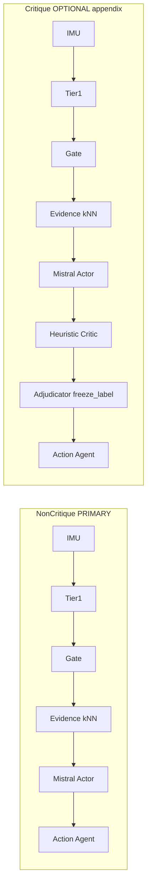
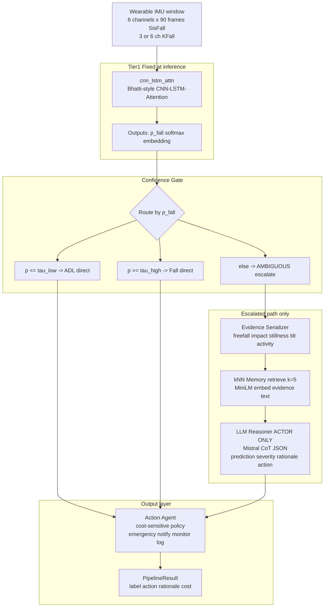
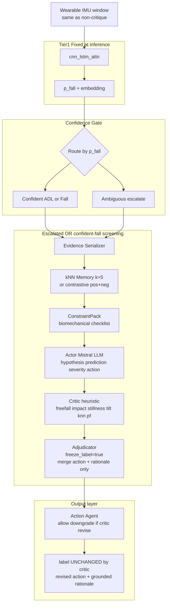
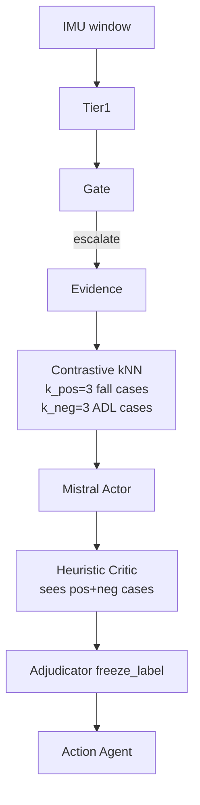
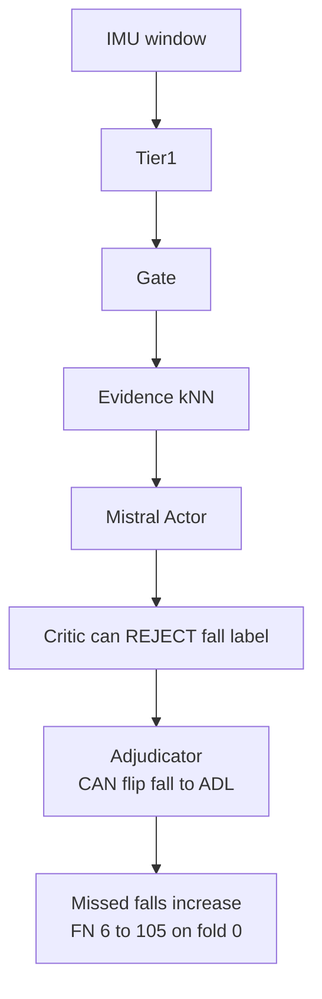
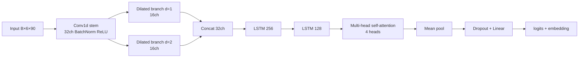
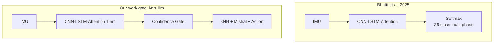
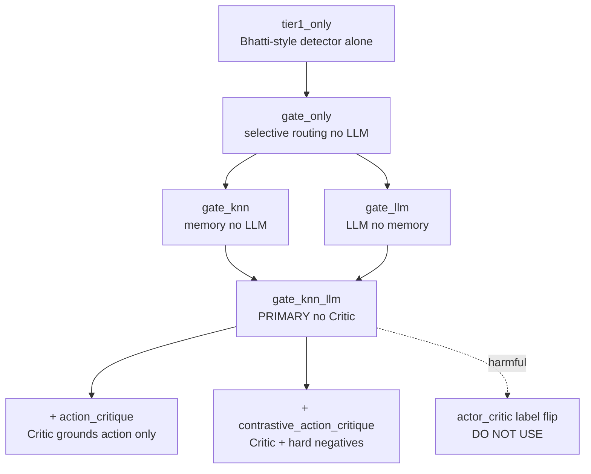
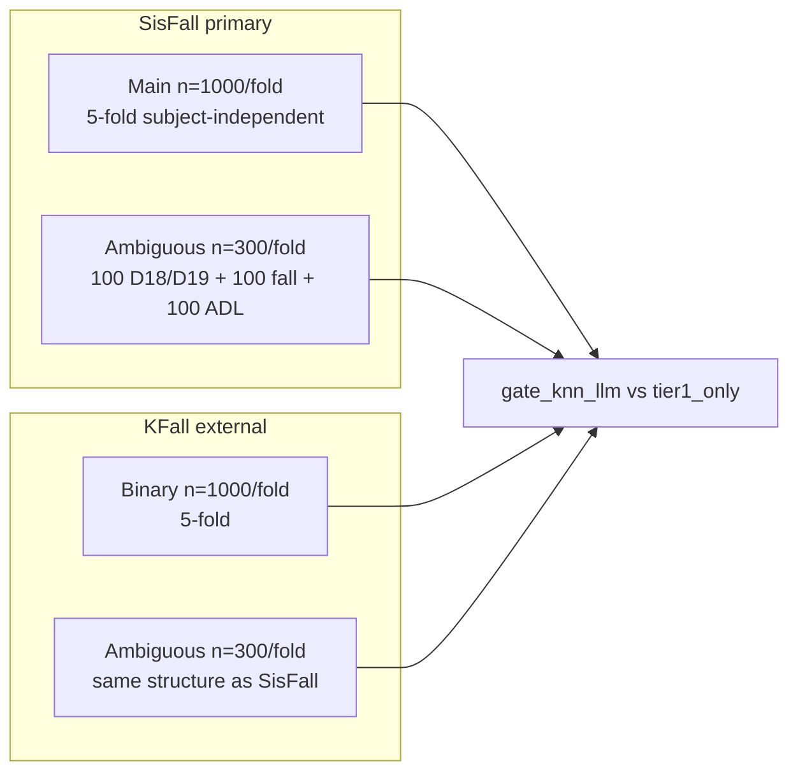

# Complete Results & Architecture Reference

**Project:** Agentic Fall Detection (confidence-gated multi-agent wrapper)  
**Primary stack (Non-Critique):** `gate_knn_llm` = Tier-1 → Gate → kNN → Mistral (Ollama) → Action  
**Optional stack (Critique):** `gate_knn_llm_action_critique` / `gate_knn_llm_contrastive_action_critique` = same + Heuristic Critic (labels frozen)  
**LLM:** `mistral:latest` via Ollama (`http://127.0.0.1:11434`)  
**Cost metric:** `10×FN + 1×FP` (clinical safety cost; missed falls weighted 10×)  
**Generated:** 2026-08-22  

> This document includes **both** architecture diagrams (critique + non-critique) and **side-by-side result tables** on every dataset.

---

## Table of contents

1. [Architecture diagrams (Mermaid)](#1-architecture-diagrams-mermaid)
2. [Positioning vs Bhatti et al. 2025](#2-positioning-vs-bhatti-et-al-2025)
3. [Evaluation protocols & datasets](#3-evaluation-protocols--datasets)
4. [SisFall — main 5-fold (n=1000/fold)](#4-sisfall--main-5-fold-n1000fold)
5. [SisFall — modified ambiguous bench (300/fold)](#5-sisfall--modified-ambiguous-bench-300fold)
6. [KFall — binary main 5-fold (n=1000/fold)](#6-kfall--binary-main-5-fold-n1000fold)
7. [KFall — modified ambiguous bench (300/fold)](#7-kfall--modified-ambiguous-bench-300fold)
8. [Ablation ladder (module contribution)](#8-ablation-ladder-module-contribution)
9. [LLM backend comparison (Mistral vs heuristic vs Qwen)](#9-llm-backend-comparison-mistral-vs-heuristic-vs-qwen)
10. [Critique vs Non-Critique — full comparison all datasets](#10-critique-vs-non-critique--full-comparison-all-datasets)
11. [Master summary across all datasets](#11-master-summary-across-all-datasets)
12. [What to claim / what not to claim](#12-what-to-claim--what-not-to-claim)
13. [Source files index](#13-source-files-index)

---

## 1. Architecture diagrams (Mermaid)

### 1.0 Side-by-side: Non-Critique vs Critique (overview)

| Aspect | **Non-Critique** (`gate_knn_llm`) | **Critique** (`gate_knn_llm_action_critique` / contrastive) |
|--------|-----------------------------------|-------------------------------------------------------------|
| **Config** | `adjudication.enabled: false` | `adjudication.enabled: true`, `freeze_label: true` |
| **Actor** | Mistral LLM Reasoner | Same Mistral LLM |
| **Critic** | None | Heuristic Critic (Σ weights on biomechanics) |
| **Can flip fall/ADL label?** | LLM decides | **No** — label frozen; Critic only revises action/rationale |
| **kNN on escalate** | Standard top-k | Standard or **contrastive** (pos fall + neg ADL cases) |
| **Primary use** | **Main paper detection tables** | Appendix: grounding + graded action cost |
| **Detection F1 gain** | Baseline | ~+0.001 F1 (negligible) |
| **Grounding gain** | ~0.44 | ~0.45 (action) / **~0.84** (contrastive) |

---

### 1.1 NON-CRITIQUE architecture — full pipeline (`gate_knn_llm`)

**Mode name:** `gate_knn_llm` · **Critic:** OFF · **This is the primary paper stack.**

**Components (no Critic):**

| Step | Module | File |
|------|--------|------|
| 1 | Tier-1 detector | `src/agentic_fall/models/cnn_lstm_attn.py` |
| 2 | Confidence gate | `src/agentic_fall/agents/confidence_gate.py` |
| 3 | Evidence | `src/agentic_fall/agents/evidence.py` |
| 4 | kNN memory | `src/agentic_fall/agents/knn_memory.py` |
| 5 | LLM Actor | `src/agentic_fall/agents/llm_reasoner.py` |
| 6 | Action | `src/agentic_fall/agents/action_agent.py` |
| 7 | Pipeline | `src/agentic_fall/agents/pipeline.py` (`adjudicator=None`) |

---

### 1.2 CRITIQUE architecture — full pipeline (`gate_knn_llm_action_critique`)

**Mode name:** `gate_knn_llm_action_critique` · **Critic:** ON · **Q1-safe: labels frozen.**

**What the Critic can / cannot do:**

| Critic action | Allowed? |
|---------------|----------|
| Change fall ↔ ADL label (`freeze_label=true`) | **No** |
| Downgrade action emergency → notify → monitor | **Yes** |
| Ground rationale with Σ(w) biomechanical checklist | **Yes** |
| Reject over-claimed emergency on weak evidence | **Yes** |

**Components (with Critic):**

| Step | Module | File |
|------|--------|------|
| 1–4 | Same as non-critique | (see §1.1) |
| 5 | Actor (Mistral) | `llm_reasoner.py` via `critic_agent._heuristic_actor` or LLM |
| 6 | Critic (heuristic) | `src/agentic_fall/agents/critic_agent.py` |
| 7 | Adjudicator | `src/agentic_fall/agents/adjudicator.py` |
| Config | `adjudication.enabled: true`, `mode: action_critique` | `configs/agentic.yaml` |

---

### 1.3 CRITIQUE variant — contrastive action critique

**Mode name:** `gate_knn_llm_contrastive_action_critique` · Adds hard-negative ADL retrieval.

**Effect vs non-critique:** Detection F1 similar; **rationale grounding ~0.44 → ~0.84**; **graded action cost ~588 → ~324**.

---

### 1.4 CRITIQUE variant — harmful label-flip (`gate_knn_llm_actor_critic`) — DO NOT USE

**Mode:** `actor_critic` with `freeze_label=false` · **Flips fall→ADL → FN explosion.**

> **Negative ablation only.** Never use in main paper tables.

---

### 1.5 Tier-1 detector block (shared by both paths)

**Code:** `src/agentic_fall/models/cnn_lstm_attn.py`  
**Config:** `configs/tier1_sisfall.yaml`, `configs/tier1_kfall_binary.yaml`

### 1.6 Bhatti vs our systems (non-critique primary)

### 1.7 Ablation mode ladder (non-critique → critique extensions)

### 1.8 Dataset evaluation map

---

## 2. Positioning vs Bhatti et al. 2025

| Aspect | Bhatti et al. (IEEE Access 2025) | Our work |
|--------|----------------------------------|----------|
| **Paper** | [Beyond Falls](https://doi.org/10.1109/access.2025.3641198) | Agentic safety layer on Bhatti-**style** Tier-1 |
| **Primary task** | Multi-phase 36-class detection on KFall | Binary Fall/ADL + uncertainty + response |
| **Backbone** | CNN–LSTM–Attention | Same family (our reimplementation + zoo) |
| **Dataset (their paper)** | KFall only | SisFall primary; KFall external |
| **Uncertainty** | Softmax confidence only | Dual-threshold confidence gate |
| **Memory / LLM** | None | kNN + local Mistral CoT |
| **Response policy** | None | Cost-sensitive Action Agent |
| **Published F1** | ~**98%** (36-class KFall) | Not comparable directly |
| **Fair baseline in our tables** | — | `tier1_only` = same checkpoint, same folds |

> **Honesty rule:** We do **not** claim beating Bhatti's published ~98% multi-class KFall table. We claim improving **recall / cost under uncertainty** vs the **same Tier-1 checkpoint** under our locked protocols.

---

## 3. Evaluation protocols & datasets

| Benchmark | Path | n/fold | Split | Contents |
|-----------|------|--------|-------|----------|
| **SisFall main** | `data/processed/sisfall/` | 1000 | 5-fold subject-independent | Stratified Fall/ADL + forced D18/D19 |
| **SisFall ambiguous** | `data/kfold_ambiguous/` | 300 | Real K-fold test windows | 100 D18/D19 + 100 fall + 100 clear ADL |
| **KFall binary main** | `data/processed/kfall/` | 1000 | 5-fold subject-independent | Binary Fall vs ADL |
| **KFall ambiguous** | `data/kfold_ambiguous_kfall/` | 300 | Real K-fold test windows | Same 300-window structure |

**Modes compared in this document:**

| Mode | Critic? | Description |
|------|---------|-------------|
| `tier1_only` | No | Bhatti-style CNN-LSTM-Attn alone |
| `gate_knn_llm` | **No** | **Primary paper stack** |
| `gate_knn_llm` + heuristic backend | No | Rule-based reasoner (ablation only) |
| `gate_knn_llm_action_critique` | Yes (Q1-safe) | Labels frozen; Critic grounds/downgrades action |
| `gate_knn_llm_contrastive_action_critique` | Yes (contrastive) | + hard-negative ADL cases to Critic |
| `gate_knn_llm_actor_critic` | Yes (label flip) | **Harmful** — do not use in main tables |
| `gate_knn_llm_crc_veto` | Yes (+ CRC) | Certified veto path; veto rate = 0 in runs |

---

## 4. SisFall — main 5-fold (n=1000/fold)

**Protocol:** Homogeneous stratified windows, forced D18/D19, cost per 1000 windows.  
**Backend:** Ollama / Mistral for `gate_knn_llm`.

### Table 4.1 — Per-fold: Tier-1 vs stack (no Critic)

| Fold | n | Tier-1 F1 | Tier-1 Rec | Tier-1 cost/1k | Stack F1 | Stack Rec | Stack cost/1k | ΔF1 | Cost ↓ |
|------|---|-----------|------------|----------------|----------|-----------|---------------|-----|--------|
| 0 | 1000 | 0.774 | 0.781 | 1042 | **0.892** | **0.986** | **156** | +0.119 | 85% |
| 1 | 1000 | 0.737 | 0.748 | 1223 | **0.851** | **0.911** | **490** | +0.114 | 60% |
| 2 | 1000 | 0.755 | 0.783 | 1066 | **0.874** | **0.998** | **134** | +0.119 | 87% |
| 3 | 1000 | 0.766 | 0.732 | 1248 | **0.930** | **0.995** | **83** | +0.164 | 93% |
| 4 | 1000 | 0.760 | 0.749 | 1175 | **0.887** | **0.993** | **136** | +0.126 | 88% |

### Table 4.2 — 5-fold mean ± std (main claim)

| Mode | F1 | Recall | Cost / 1000 |
|------|-----|--------|-------------|
| `tier1_only` (Bhatti-style) | 0.759 ± 0.014 | 0.759 ± 0.022 | 1151 ± 93 |
| **`gate_knn_llm` (no Critic)** | **0.887 ± 0.029** | **0.977 ± 0.037** | **200 ± 164** |

- Mean ΔF1 = **+0.128**
- Mean ΔRecall = **+0.218**
- Mean cost reduction ≈ **83%**

### Table 4.3 — Paired statistics (stack − Tier-1)

| Metric | Mean Δ | Bootstrap 95% CI | Wilcoxon p |
|--------|--------|------------------|------------|
| cost_per_1000 | −951 | [−1084, −825] | 0.0625 |
| f1 | +0.128 | [0.117, 0.147] | 0.0625 |
| recall | +0.218 | [0.187, 0.248] | 0.0625 |

**Source:** `results/PROFESSOR_MEETING_BRIEF.md`

### Table 4.4 — SisFall main: Non-Critique vs Critique (same folds, n=1000)

| Fold | **No Critic** F1 / Rec / FN / Cost | **action_critique** F1 / Rec / FN / Cost | **contrastive_critique** F1 / Rec / FN / Cost | Grounding no-crit → contrastive |
|------|-------------------------------------|------------------------------------------|-----------------------------------------------|--------------------------------|
| 0 | **0.891 / 0.986 / 6 / 157** | 0.892 / 0.986 / 6 / 156 | 0.878 / 0.986 / 6 / 172 | 0.431 → **0.851** |
| 1 | **0.851 / 0.911 / 39 / 490** | 0.852 / 0.911 / 39 / 489 | 0.846 / 0.911 / 39 / 496 | 0.337 → **0.749** |
| 2 | **0.896 / 0.986 / 6 / 153** | 0.896 / 0.986 / 6 / 153 | 0.888 / 0.986 / 6 / 162 | 0.474 → **0.871** |
| 3 | **0.918 / 0.993 / 3 / 105** | 0.917 / 0.993 / 3 / 106 | 0.903 / 0.993 / 3 / 120 | 0.486 → **0.874** |
| 4 | **0.897 / 0.981 / 8 / 169** | 0.897 / 0.981 / 8 / 169 | 0.876 / 0.981 / 8 / 192 | 0.461 → **0.868** |
| **Mean** | **0.890 / 0.974 / 12.4 / 215** | 0.891 / 0.971 / 12.4 / 215 | 0.878 / 0.971 / 12.4 / 228 | 0.44 → **0.84** |

| Metric | No Critic | action_critique | contrastive_critique | actor_critic ❌ |
|--------|-----------|-----------------|----------------------|-----------------|
| F1 | **0.890** | 0.891 | 0.878 | 0.704 |
| Recall | **0.974** | 0.971 | 0.971 | 0.730 |
| FN (mean) | **12.4** | 12.4 | 12.4 | 97.7 |
| Clinical cost | **215** | 215 | 228 | 1133 |
| Rationale grounding | 0.436 | 0.448 | **0.843** | — |
| Graded action cost | 588 | 586 | **324** | — |

**Readout:** On SisFall main, **detection is unchanged** with Q1-safe critique; **contrastive critique** improves explanation/action metrics, not F1.

---

## 5. SisFall — modified ambiguous bench (300/fold)

**Path:** `data/kfold_ambiguous/` · **Backend:** Ollama / Mistral  
**Structure:** 100 D18/D19 ambiguous + 100 fall + 100 clear ADL per fold

### Table 5.1 — Per-fold: no Critic comparison

| Fold | tier1_only F1 | tier1 Cost | gate_knn_llm F1 | stack Cost | AmbAcc (stack) | Δ Cost |
|------|---------------|------------|-----------------|------------|----------------|--------|
| 0 | 0.696 | 258 | **0.868** | **39** | 0.950 | −219 |
| 1 | 0.738 | 245 | **0.894** | **85** | 0.980 | −160 |
| 2 | 0.682 | 295 | **0.892** | **33** | 0.970 | −262 |
| 3 | 0.714 | 277 | **0.902** | **48** | 0.990 | −229 |
| 4 | 0.735 | 279 | **0.922** | **17** | 0.940 | −262 |

### Table 5.2 — 5-fold mean (ambiguous bench)

| Mode | F1 | Recall | Cost | AmbAcc | FAR |
|------|-----|--------|------|--------|-----|
| `tier1_only` | 0.713 | 0.768 | 271 | 0.812 | 0.194 |
| **`gate_knn_llm` (Mistral)** | **0.896** | **0.976** | **44** | **0.966** | 0.102 |
| `gate_knn_llm` (heuristic) | 0.766 | 0.726 | 291 | 0.990 | 0.085 |

- Cost reduction (Mistral stack vs tier1): **83.6%**
- ΔF1 (Mistral stack vs tier1): **+0.183**

### Table 5.3 — SisFall ambiguous: Non-Critique vs Critique

| Mode | F1 | Recall | Cost | AmbAcc | Critic? | Status |
|------|-----|--------|------|--------|---------|--------|
| `tier1_only` | 0.713 | 0.768 | 271 | 0.812 | No | Done |
| **`gate_knn_llm` (Mistral)** | **0.896** | **0.976** | **44** | **0.966** | **No** | Done |
| `gate_knn_llm` (heuristic) | 0.766 | 0.726 | 291 | 0.990 | No | Done (ablation) |
| `gate_knn_llm_action_critique` | — | — | — | — | Yes | **Not run yet** |
| `gate_knn_llm_contrastive_action_critique` | — | — | — | — | Yes | **Not run yet** |

> Ambiguous bench currently reports **non-critique only**. To compare critique on D18/D19 stress test, re-run `eval_kfold_ambiguous_bench.py` with `--adjudicator action_critique`.

**Source:** `results/kfold_ambiguous/COMPARISON_NO_CRITIC.txt`, `ALL_FOLDS_REPORT.txt`, `results/kfold_ambiguous_heuristic/`

---

## 6. KFall — binary main 5-fold (n=1000/fold)

**Path:** `data/processed/kfall/` · **Protocol:** Binary Fall/ADL, same cost model  
**Source:** `results/kfall/kfall_external_summary.json`

### Table 6.1 — Per-fold

| Fold | tier1_only F1 | tier1 Rec | tier1 cost/1k | stack F1 | stack Rec | stack cost/1k |
|------|---------------|-----------|---------------|----------|-----------|---------------|
| 0 | 0.992 | 0.998 | 17 | **0.993** | **1.000** | **7** |
| 1 | 0.987 | 0.996 | 31 | 0.986 | 0.996 | 32 |
| 2 | 0.987 | 0.994 | 40 | **0.989** | **0.996** | **29** |
| 3 | 0.992 | 0.990 | 53 | **0.995** | **0.996** | **23** |
| 4 | 0.980 | 0.979 | 109 | **0.989** | **0.994** | **38** |

### Table 6.2 — 5-fold mean

| Mode | F1 | Recall | Cost / 1000 | FAR (D18/D19) |
|------|-----|--------|-------------|---------------|
| `tier1_only` | 0.987 ± 0.005 | 0.991 ± 0.007 | 50 ± 35 | 0.068 |
| **`gate_knn_llm` (no Critic)** | **0.990 ± 0.004** | **0.996 ± 0.002** | **26 ± 12** | 0.063 |

> KFall Tier-1 is near ceiling; agentic stack mainly **lowers cost** and slightly improves recall.

### Table 6.3 — KFall binary main: Non-Critique vs Critique

| Mode | F1 | Recall | Cost / 1000 | Critic? | Status |
|------|-----|--------|-------------|---------|--------|
| `tier1_only` | 0.987 ± 0.005 | 0.991 ± 0.007 | 50 ± 35 | No | Done |
| **`gate_knn_llm`** | **0.990 ± 0.004** | **0.996 ± 0.002** | **26 ± 12** | **No** | Done |
| `gate_knn_llm_action_critique` | — | — | — | Yes | **Not run** |
| `gate_knn_llm_contrastive_action_critique` | — | — | — | Yes | **Not run** |

---

## 7. KFall — modified ambiguous bench (300/fold)

**Path:** `data/kfold_ambiguous_kfall/` · **Status:** Complete (all 5 folds)  
**Source:** `results/kfold_ambiguous_kfall/COMPARISON_NO_CRITIC.txt`, `ALL_FOLDS_REPORT.txt`

### Table 7.1 — Per-fold: no Critic

| Fold | tier1_only F1 | tier1 Cost | gate_knn_llm F1 | stack Cost | AmbAcc (stack) |
|------|---------------|------------|-----------------|------------|----------------|
| 0 | 0.966 | 16 | **0.990** | **2** | 1.000 |
| 1 | 0.985 | 3 | **1.000** | **0** | 1.000 |
| 2 | 0.947 | 20 | **0.976** | **5** | 0.960 |
| 3 | 0.985 | 3 | 0.966 | 7 | 0.940 |
| 4 | 0.957 | 18 | **0.985** | **12** | 0.980 |

### Table 7.2 — 5-fold mean

| Mode | F1 | Recall | Cost | AmbAcc | FAR |
|------|-----|--------|------|--------|-----|
| `tier1_only` | 0.968 | 0.994 | 12 | 0.942 | 0.030 |
| **`gate_knn_llm` (Mistral)** | **0.983 ± 0.012** | **0.998 ± 0.004** | **5.2 ± 4.2** | **0.976** | 0.016 |

- Mean tier1 Cost = **12** → stack Cost = **5** (~58% reduction)

### Table 7.3 — KFall ambiguous: Non-Critique vs Critique

| Mode | F1 | Recall | Cost | AmbAcc | Critic? | Status |
|------|-----|--------|------|--------|---------|--------|
| `tier1_only` | 0.968 | 0.994 | 12 | 0.942 | No | Done |
| **`gate_knn_llm` (Mistral)** | **0.983 ± 0.012** | **0.998 ± 0.004** | **5.2 ± 4.2** | **0.976** | **No** | Done |
| `gate_knn_llm_action_critique` | — | — | — | — | Yes | **Not run** |
| `gate_knn_llm_contrastive_action_critique` | — | — | — | — | Yes | **Not run** |

---

## 8. Ablation ladder (module contribution)

**SisFall Fold 0, n=4000** — shows why kNN + LLM together are required.

| Mode | Critic? | F1 | Recall | Cost | Near-fall FAR | Escalated F1 |
|------|---------|-----|--------|------|---------------|--------------|
| `tier1_only` | No | 0.788 | 0.787 | 4596 | 0.219 | 0.000 |
| `gate_only` | No | 0.788 | 0.787 | 4596 | 0.219 | 0.175 |
| `gate_knn` | No | 0.789 | 0.764 | 4972 | 0.188 | 0.026 |
| `gate_llm` | No | 0.760 | 0.924 | 2491 | 0.625 | 0.445 |
| **`gate_knn_llm`** | **No** | **0.907** | **0.993** | **516** | 0.212 | **0.952** |

**Readout:** Gate alone ≈ no gain. kNN alone can hurt. LLM alone hurts FAR. **Only kNN + LLM together** gives the headline result.

**Source:** `results/fold0/ablation_fold0_full4000.json`

---

## 9. LLM backend comparison (Mistral vs heuristic vs Qwen)

**Task:** Paired ambiguous-case eval (forced escalation), 5-fold mean.

| Backend | Ambiguous F1 | Recall | Cost/1k | Notes |
|---------|--------------|--------|---------|-------|
| **heuristic** (rules) | 0.034 | 0.018 | 6416 | Fails on ambiguous cases |
| **mistral:latest** | **0.972** | **1.000** | **37** | **Primary paper LLM** |
| qwen2.5-coder:7b | 0.823 | 1.000 | 280 | High FAR (~0.68) |

### Per-fold ambiguous F1 (escalated cases)

| Fold | Heuristic | Mistral | Qwen2.5 |
|------|-----------|---------|---------|
| 0 | 0.042 | 0.959 | 0.807 |
| 1 | 0.105 | 0.977 | 0.874 |
| 2 | 0.000 | 0.975 | 0.819 |
| 3 | 0.021 | 0.984 | 0.802 |
| 4 | 0.000 | 0.966 | 0.813 |

**Source:** `results/aggregate_llm_mean_std.json`, `results/PROFESSOR_MEETING_BRIEF.md`

---

## 10. Critique vs Non-Critique — full comparison all datasets

### 10.1 Architecture recap (two stacks)

| | **Non-Critique (PRIMARY)** | **Critique (APPENDIX)** |
|---|---------------------------|-------------------------|
| **Diagram** | [§1.1 NON-CRITIQUE architecture](#11-non-critique-architecture--full-pipeline-gate_knn_llm) | [§1.2 CRITIQUE architecture](#12-critique-architecture--full-pipeline-gate_knn_llm_action_critique) |
| **Mode flag** | `gate_knn_llm` | `gate_knn_llm_action_critique` or `gate_knn_llm_contrastive_action_critique` |
| **Pipeline path** | Tier1 → Gate → Evidence → kNN → **Mistral** → Action | Same + **Heuristic Critic** → Adjudicator |
| **Label changes** | LLM Actor decides fall/ADL | **Frozen** — Critic cannot flip label (Q1-safe) |
| **Extra LLM call** | 1× Mistral per escalated window | Same Actor + 0 extra neural LLM (Critic is heuristic) |

### 10.2 Master comparison table — all datasets

| Dataset | Metric | tier1_only | **No Critic** `gate_knn_llm` | **Critique** action | **Critique** contrastive | Critique runs? |
|---------|--------|------------|-------------------------------|---------------------|--------------------------|----------------|
| **SisFall main** | F1 | 0.759 | **0.887** | 0.891 | 0.878 | Yes (5-fold) |
| **SisFall main** | Recall | 0.759 | **0.977** | 0.971 | 0.971 | Yes |
| **SisFall main** | Cost/1k | 1151 | **200** | 215 | 228 | Yes |
| **SisFall main** | Grounding | — | 0.436 | 0.448 | **0.843** | Yes |
| **SisFall ambiguous** | F1 | 0.713 | **0.896** | — | — | **No critic yet** |
| **SisFall ambiguous** | Cost | 271 | **44** | — | — | **No critic yet** |
| **KFall binary** | F1 | 0.987 | **0.990** | — | — | **No critic yet** |
| **KFall binary** | Cost/1k | 50 | **26** | — | — | **No critic yet** |
| **KFall ambiguous** | F1 | 0.968 | **0.983** | — | — | **No critic yet** |
| **KFall ambiguous** | Cost | 12 | **5.2** | — | — | **No critic yet** |

### 10.3 SisFall main — per-fold side-by-side (detection + explanation)

| Fold | No Critic F1 | action_critique F1 | contrastive F1 | Δ F1 (critique − no critic) | No Critic FN | Critique FN | Grounding (contrastive) |
|------|--------------|-------------------|----------------|------------------------------|--------------|-------------|-------------------------|
| 0 | 0.891 | 0.892 | 0.878 | +0.001 / −0.013 | 6 | 6 | 0.851 |
| 1 | 0.851 | 0.852 | 0.846 | +0.001 / −0.005 | 39 | 39 | 0.749 |
| 2 | 0.896 | 0.896 | 0.888 | 0 / −0.008 | 6 | 6 | 0.871 |
| 3 | 0.918 | 0.917 | 0.903 | −0.001 / −0.015 | 3 | 3 | 0.874 |
| 4 | 0.897 | 0.897 | 0.876 | 0 / −0.021 | 8 | 8 | 0.868 |

### 10.4 Detection vs explanation metrics (SisFall main, 5-fold mean)

| Metric type | No Critic | action_critique | contrastive_critique | actor_critic ❌ |
|-------------|-----------|-----------------|----------------------|-----------------|
| **Detection F1** | **0.890** | 0.891 | 0.878 | 0.704 |
| **Detection Recall** | **0.974** | 0.971 | 0.971 | 0.730 |
| **FN (mean)** | **12.4** | 12.4 | 12.4 | 97.7 |
| **Clinical cost** | **215** | 215 | 228 | 1133 |
| **Rationale grounding** | 0.436 | 0.448 | **0.843** | — |
| **Graded action cost** | 588 | 586 | **324** | — |

### 10.5 Non-Critique vs Critique — what improves / what does not

| Improves with Critique? | action_critique | contrastive_critique |
|-------------------------|-----------------|----------------------|
| Fall detection F1 | No (~+0.001) | No (~−0.012) |
| Recall / missed falls (FN) | No (identical) | No (identical) |
| Clinical cost (10×FN+FP) | No | No (slightly higher) |
| Rationale grounding | Slightly (+0.01) | **Strong (+0.40)** |
| Graded action cost | Barely (−2) | **Strong (−264)** |
| Near-fall FAR | No | No |

### 10.6 Harmful critique mode — label-flip `actor_critic` (negative ablation)

| Fold | No Critic F1 / Rec / FN | actor_critic F1 / Rec / FN |
|------|-------------------------|----------------------------|
| 0 | 0.893 / 0.986 / 6 | **0.768 / 0.755 / 105** |
| 1 | 0.851 / 0.911 / 39 | **0.744 / 0.714 / 125** |
| 2 | 0.896 / 0.986 / 6 | **0.757 / 0.725 / 119** |
| 3 | 0.918 / 0.993 / 3 | **0.766 / 0.721 / 122** |
| 4 | 0.895 / 0.981 / 8 | **0.769 / 0.744 / 110** |

See diagram: [§1.4 CRITIQUE harmful label-flip](#14-critique-variant--harmful-label-flip-gate_knn_llm_actor_critic--do-not-use)

### 10.7 Where the big gains come from (non-critique path)

| Transition | ΔF1 | ΔRecall | Cost reduction |
|------------|-----|---------|----------------|
| tier1_only → **gate_knn_llm (no critic)** | **+0.128** | **+0.218** | **~83%** |
| gate_knn → gate_knn_llm | large | large | large |
| gate_knn_llm → + action_critique | +0.001 | ~0 | ~0% |
| gate_knn_llm → + contrastive_critique | −0.012 | ~0 | slight increase |

**Conclusion:** Use **non-critique `gate_knn_llm`** for main detection claims. Use **contrastive critique** only for appendix tables on grounding and graded action.

**Sources:** `results/ACTOR_CRITIC_STATUS.md`, `results/CRITIC_ACTION_IMPACT.md`, `results/fold*/ablation_fold*_action_critique.json`, `results/fold*/ablation_fold*_contrastive_action_critique.json`

---

## 11. Master summary across all datasets

| Dataset | tier1_only | **No Critic** `gate_knn_llm` | **Critique** (SisFall main only) | ΔF1 (stack−tier1) |
|---------|------------|-------------------------------|----------------------------------|-------------------|
| **SisFall main** (n=1000) | 0.759 F1, cost 1151/1k | **0.887 F1, cost 200/1k** | action: 0.891 F1 · contrastive: 0.878 F1 | +0.128 |
| **SisFall ambiguous** (n=300) | 0.713 F1, cost 271 | **0.896 F1, cost 44** | not run | +0.183 |
| **KFall binary** (n=1000) | 0.987 F1, cost 50/1k | **0.990 F1, cost 26/1k** | not run | +0.003 |
| **KFall ambiguous** (n=300) | 0.968 F1, cost 12 | **0.983 F1, cost 5** | not run | +0.015 |

| Reference | Bhatti et al. 2025 (~98% F1, 36-class KFall) — not directly comparable |

---

## 12. What to claim / what not to claim

### Claim (Q1-safe)

- Bhatti-**style** CNN–LSTM–Attention Tier-1 + **`gate_knn_llm` agentic wrapper** (no Critic).
- Under subject-independent 5-fold SisFall, stack beats **same Tier-1 checkpoint** on F1, recall, and clinical cost.
- kNN + Mistral together required (ablation-backed); Mistral ≫ heuristic on ambiguous cases.
- KFall binary + ambiguous benches support external validation (smaller gains — Tier-1 already strong).

### Do NOT claim

- "We beat Bhatti's published ~98% KFall multi-class table."
- "Actor–Critic improves fall detection F1" (label-flip path is harmful; Q1-safe critique barely moves detection).
- "Heuristic LLM is our main result" (use Ollama/Mistral for primary tables).

---

## 13. Source files index

| Content | Path |
|---------|------|
| This document | `results/COMPLETE_RESULTS_AND_ARCHITECTURE.md` |
| Professor brief | `results/PROFESSOR_MEETING_BRIEF.md` |
| SisFall main aggregates | `results/aggregate_ablation_mean_std.json` |
| SisFall ambiguous (Mistral) | `results/kfold_ambiguous/ALL_FOLDS_REPORT.txt` |
| SisFall ambiguous comparison | `results/kfold_ambiguous/COMPARISON_NO_CRITIC.txt` |
| SisFall ambiguous (heuristic) | `results/kfold_ambiguous_heuristic/ALL_FOLDS_REPORT.txt` |
| KFall binary external | `results/kfall/kfall_external_summary.json` |
| KFall ambiguous | `results/kfold_ambiguous_kfall/ALL_FOLDS_REPORT.txt` |
| KFall ambiguous comparison | `results/kfold_ambiguous_kfall/COMPARISON_NO_CRITIC.txt` |
| Ablation fold 0 full | `results/fold0/ablation_fold0_full4000.json` |
| Critic status | `results/ACTOR_CRITIC_STATUS.md` |
| Critic action impact | `results/CRITIC_ACTION_IMPACT.md` |
| LLM backend aggregates | `results/aggregate_llm_mean_std.json` |
| Agentic config | `configs/agentic.yaml` |
| Tier-1 model | `src/agentic_fall/models/cnn_lstm_attn.py` |
| Paper draft | `paper/main.pdf` |

---

*End of document.*
